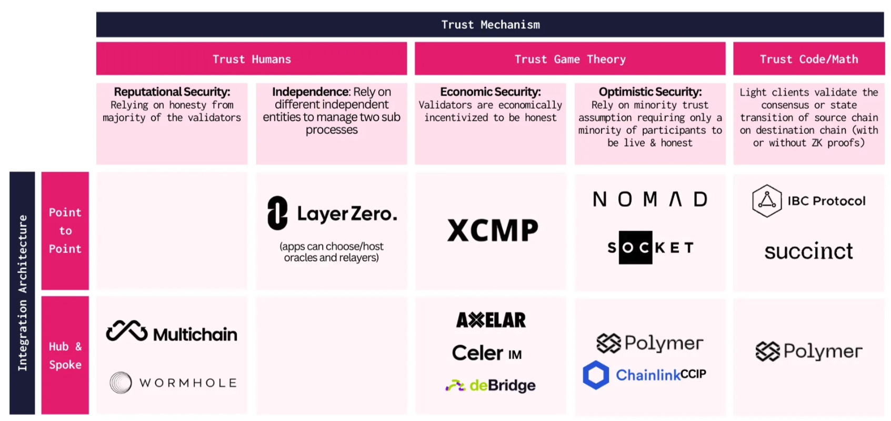
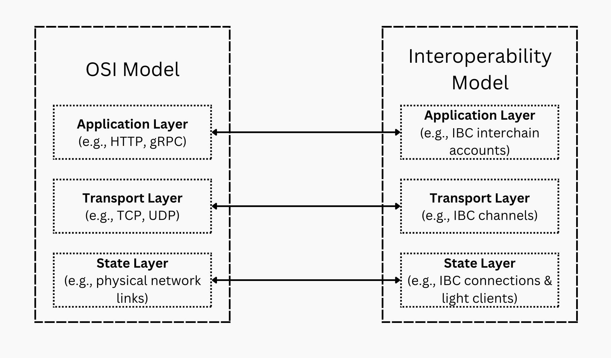

# Interoperability: why do we need it?

The blockchain space is moving towards an ever growing number of execution shards appearing. L1s, alt-L1s, rollups, app chains and app rollups all fall under this category. Modular blockchains also further complicate the landscape by massively opening up the design space for blockchains.

:::note

These advancements improve the overall throughput of web3 as a whole but **increase fragmentation**. What’s gained in scalability is lost in lack of interoperability.

:::
:::tip Toward interoperability standards

This motivates the need for industry wide interoperability standards as well as a secure and trust-minimized communication layer.

:::

This explosion in different execution environments all but solidify the importance of interoperability, incentivizing a fierce competition among novel and existing interoperability protocols alike.

## The interoperability model

To solve this problem, numerous projects have tried [different approaches ranging from highly centralized solutions using a permissioned relayer and oracle pair to computing zero knowledge consensus proofs](https://longhashvc.medium.com/navigating-the-web-of-interoperability-a-deep-dive-into-arbitrary-message-passing-protocols-43a469b9e7d). The main issue with these approaches is that they are merely innovating on _how to move the state from one blockchain to another_. This indeed is a critical part of the interoperability problem but is far from the complete picture as the state component only addresses the lowest layer of the interoperability model.

[Source](https://longhashvc.medium.com/navigating-the-web-of-interoperability-a-deep-dive-into-arbitrary-message-passing-protocols-43a469b9e7d)

### Taking the OSI model as inspiration

At Polymer, we believe that **a complete interoperability model consists of 3 layers with clear separation between each layer**.

The layers in the interoperability model mirror familiar ones in the classic Open Systems Interconnection model (OSI model) for network communication.

1. **The application layer** represents application logic that sits on top of the common transport layer. There are already a number of application protocol standards in IBC ranging from basic functionality like token transfers [ICS20](https://github.com/cosmos/ibc/tree/main/spec/app/ics-020-fungible-token-transfer) to advanced functionality like cross chain validation [ICS28](https://github.com/cosmos/ibc/tree/main/spec/app/ics-028-cross-chain-validation) (also known as interchain security). **As a developer of IBC-enabled smart contracts, you are challenged to further develop IBC on this layer**.

2. **The transport layer** of IBC encodes transport, authentication and ordering (TAO) logic. The transport logic in IBC is _almost identical to that of TCP and UDP_ and for good reason. Most competing interoperability protocols have extremely simplistic transport layer implementations that lack TAO logic and do not have an accompanying specification.

3. Most of the innovation in the space has been happening at **the state layer**, or how to move state (proofs) from one chain to another. All of the trust mechanisms below are encoded as clients in the IBC model. The [02-client specification](https://github.com/cosmos/ibc/tree/main/spec/core/ics-002-client-semantics) allows for the definition of a variety of client types inclusive of most if not all trust mechanisms used in the space.

## Tackling interoperability fragmentation

Increasing interoperability fragmentation is a mostly ignored fact since all of the focus of builders and investors has been on the _state layer_ of interoperability as depicted above.

:::caution Interoperability can fragment the landscape too

Focusing on the speed to go to market, most new interoperability protocols exacerbate the issues by introducing **incompatible transport layers further fragmenting web3**.

:::

Counter intuitively perhaps, the _transport layer_ is arguably the most important layer in the interoperability model. The transport layer produces a commitment to all of the messages sent and received from a chain while also enforcing TAO logic. This commitment is called a [_transport commitment_](../concepts/vibc/clients.md/#fork-handling-and-virtual-roots).

Currently, transport commitments produced by one interoperability protocol are not understood by another, requiring translation layers between protocols. This is anti-competitive and promotes vendor lock-in at the protocol level.

:::tip Developer first

_Who's ultimately going to be the be the victim of this fragmentation and incompatibility?_

We think it's the developers (and through them, the end-users). At Polymer, we believe we should **put the developers first and strive for transport standards** that allow to transfer your skills and knowledge to any environment.

:::

### Incentivization

Additionally, there are no protocol level incentives that encourage open participation of clients at the state layer.

<!-- TODO: add link to client incentivization work -->
:::note Client incentivization

With some of the IBC innovations that the Polymer Labs team is working on, client update incentivization will happen _in protocol_ ensuring an open market for clients.

:::

### IBC as the standard

Instead of building yet another incompatible transport layer, the Polymer Labs team has been working on **firmly establishing the open-source IBC (inter-blockchain communication) protocol as the universal interop standard**. Put in a different way, we advocate the transport commitments produced by every interoperability follow the IBC standard.

While it’s normally quite difficult to integrate and maintain IBC compatibility natively in a chain, Polymer, Ethereum's IBC interoperability hub, makes it possible to **integrate and add IBC transport to any chain in a minimally intrusive manner**. The different interoperability protocols of today can opt in to become IBC clients in the IBC network of tomorrow.

## Why should you care?

Through its efforts, Polymer plays a pivotal role in the wide adoption of IBC as a transport layer standard.

You, **the developers of IBC applications, are the prime benefactors** of this push towards standardization because of the following benefits:

- [Flexibility in terms of the state layer solutions are encapsulated in the IBC client interface](../concepts/ibc/ibc-clients.md), so they don't interfere with the standardization of transport commitments. This will lead to your developer experience being similar when developing cross-chain applications, no matter what chains and ecosystems are involved.
- No vendor lock-in, but open-source contributions and freedom of choice on the protocol level
- With [IBC as the transport layer standard](../concepts/ibc/ibc.md), efforts towards developer tooling, education and support with respect to interoperability will grow much faster without fragmentation holding the space back.

