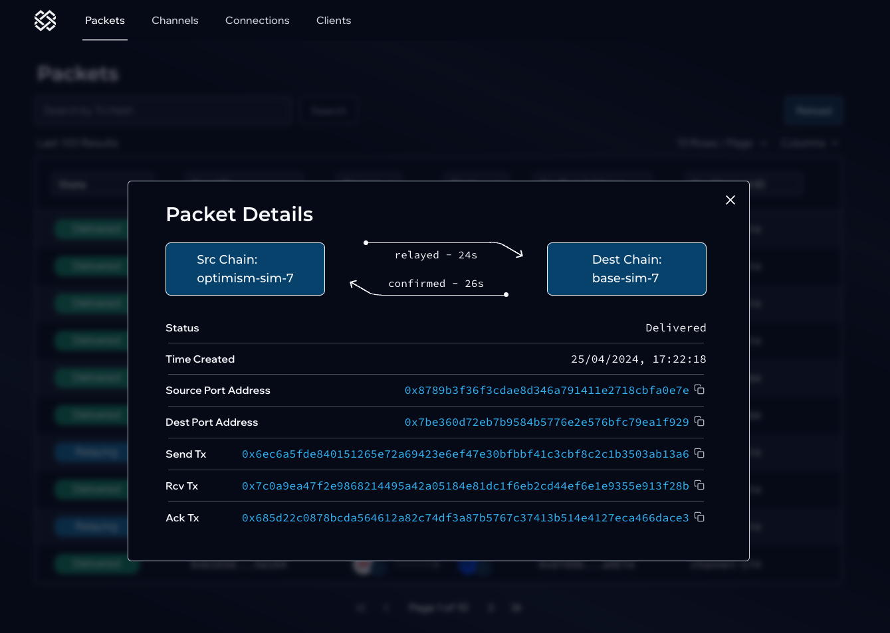

# Events overview for vIBC

:::caution Disclaimer

The Polymer testnet is currently in an early public testnet phase. Please be aware that during this phase, the network may be subject to instability, downtime, and data resets. Read the full disclaimer [here](../build/disclaimer.md).

:::

When debugging the IBC packet lifecycle, the first step to take is to track down the packet during its lifecycle and where any potential issue arises.

For example, you can find reference to these events (or rather, the transaction they were emitted from) by looking at [IBC explorer](https://sepolia.polymer.zone/packets).

As an application developer, you'll be mostly looking at the events on the chains your application(s) live on, not Polymer itself in the middle. 
Below you find the sequence of events for all possible situations.

:::note Ethereum L2 interoperability

When connecting Ethereum L2s that don't have native IBC implementations, the virtual-to-virtual case is applicable.

OP (Sepolia) to Base (Sepolia) is an example

:::

## Virtual to virtual

| Actor         | Virtual chain A              | Polymer                  | Virtual Chain B              |
|---------------------|------------------------------|--------------------------|------------------------------|
| vIBC Core SC         | SendPacket            | -                        | -                            |
| IBC module         | -                            | SendPacket               | -                            |
| IBC module         | -                            | RecvPacket               | -                            |
| vIBC Core SC         | -                            | -                        | RecvPacket        |
| vIBC Core SC         | -                            | -                        | WriteAck              |
| IBC module         | -                            | WriteAck                 | -                            |
| IBC module         | -                            | AcknowledgePacket        | -                            |
| vIBC Core SC         | AcknowledgePacket | -                        | -                            |

## Virtual (sender) to IBC native

| Actor         | Virtual chain A              | Polymer                  | IBC Chain B              |
|---------------------|------------------------------|--------------------------|------------------------------|
| vIBC Core SC         | SendPacket            | -                        | -                            |
| IBC module         | -                            | SendPacket               | -                            |
| IBC module         | -                            | -               | RecvPacket                            |
| IBC module         | -                            | -                 | WriteAck                            |
| IBC module         | -                            | AcknowledgePacket        | -                            |
| vIBC Core SC         | AcknowledgePacket | -                        | -                            |

## IBC native to Virtual (receiver)

| Actor         | Virtual chain A              | Polymer                  | Virtual Chain B              |
|---------------------|------------------------------|--------------------------|------------------------------|
| IBC module         | SendPacket                            | -               | -                            |
| IBC module         | -                            | RecvPacket               | -                            |
| vIBC Core SC         | -                            | -                        | RecvPacket        |
| vIBC Core SC         | -                            | -                        | WriteAck              |
| IBC module         | -                            | WriteAck                 | -                            |
| IBC module         | AcknowledgePacket                            | -        | -                            |
