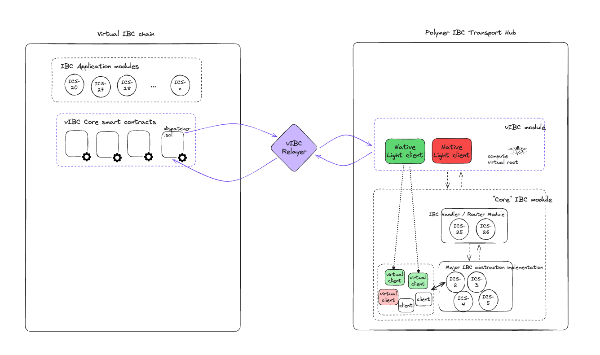

# The vIBC core smart contracts


One of the differentiating features of the Polymer chain, is its ability to enable IBC for chains (rollups) that don't have a native implementation and/or compatibility. We call these chains _virtual chains_ in the language of [vIBC](../../learn/concepts/vibc/overview.md).

To ensure that these chains have access to the IBC transport layer, Polymer enables to run the IBC transport layer on their behalf.

## Theory

From the [concepts section on vIBC](../../learn/concepts/vibc/components.md), we get the following takeaway:


> vIBC is essentially the answer to the question how to adapt IBC when it is modular, i.e. the transport layer lives on another chain than the applications using it.
Another way look at it, is to consider it an extension of the IBC handler/router submodules to facilitate IBC communication asynchronously across chains.



For the cross-chain Dapp developer this implies that their application modules (smart contracts) that implement the [IBC application module interface defined by ICS-26](https://github.com/cosmos/ibc/tree/main/spec/core/ics-026-routing-module#module-callback-interface) will not exchange information with a core IBC implementation _on the chain it's hosted on_, but **with Polymer's IBC implementation**.

Instead of having the IBC handler (and routing) module handle communication between IBC application modules and the IBC core all on the same chain, that functionality is extended by virtual IBC to allow for outsourcing IBC core functionality.

:::note 

The IBC handler (and routing) in virtual IBC consists of:

1. the vIBC core smart contracts _on the virtual chain_
2. the _off-chain_ vIBC relayer that relays communication between virtual chain and Polymer (or any other IBC hub implementing virtual IBC protocol)
3. a `vIBC` module _on Polymer_ that wraps around the core IBC module (ibc-go) also on Polymer.

:::

Let's take a closer look at the vIBC core smart contracts.

## Practical

When developing IBC application modules or smart contracts on a virtual chain (e.g. Ethereum), you'll need the following:

- access to the interfaces defined by the vIBC core smart contracts (e.g. [`IbcReceiver` interface](https://github.com/open-ibc/vibc-core-smart-contracts/blob/main/contracts/interfaces/IbcReceiver.sol) for IBC application modules)
- the address of the _Dispatcher_ vIBC core smart contract on the virtual chain

:::note vIBC core contracts source code
The vIBC core smart contracts can be found in [this GitHub repo](https://github.com/open-ibc/vibc-core-smart-contracts).
:::

Include the vIBC core smart contracts to your project by running the following command into your project:

```bash
git submodule add https://github.com/open-ibc/vibc-core-smart-contracts.git [optional-destination-path]
```

Alternatively, consider using [Foundry](https://book.getfoundry.sh/getting-started/installation) to manage the dependencies:
```bash
forge install open-ibc/vibc-core-smart-contracts
```

You can then import for example the `IbcReceiverBase` interface to extend your IBC enabled contract, like so:

```solidity
...
// replace $VIBC by the path (or store it as the $VIBC environment variable) you stored the submodule at
import '$VIBC/contracts/interfaces/IbcReceiverBase.sol'
...
// have your application contract implement the interface
contract MyIbcContract is IbcReceiver {
    ...
}
```

:::tip Use IBC app template

Just adding the vibc-core-smart-contracts as a dependency to your project is possible, but we have a template repository named [ibc-app-solidity-template](https://github.com/open-ibc/ibc-app-solidity-template) which abstracts away a lot of the complexity and is a great place to start!

:::

Continue on to the [next section](ibc-solidity.md) to see how to implement the interfaces to write IBC enabled smart contracts.
