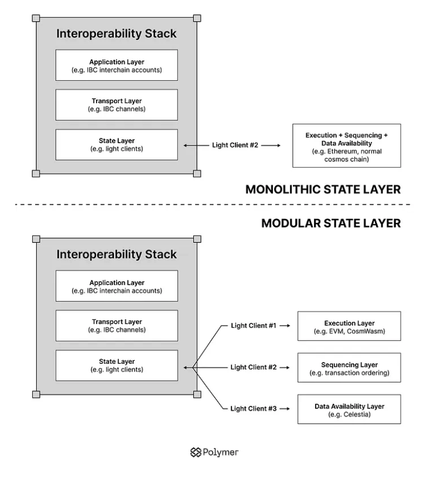
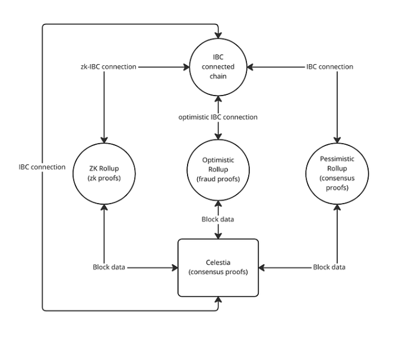

# IBC for the modular world

As the IBC interoperability hub for Ethereum with its rollup-centric vision, Polymer will be at the forefront of solving the interoperability problme for modular blockchains, enter _modular IBC_. 

:::caution Everything's modular these days, but what does it mean?

Ever since Celestia first introduced the concept of the modular blockchain paradigm, there has been ever increasing hype for the concept and the term _modular_ arguably is overused. In that vein, modular IBC, might be somewhat ambiguous, so let's clarify.

- A **modular interoperability protocol**: as outlined [in the interoperability intro](../../background/interop.md), we consider a complete interoperability protocol one that has clear separation between application, transport and state layers. A modular interop protocol then, is one that **fully outsources the transport layer** to a dedicated transport hub, like Polymer

- **IBC (clients) for modular blockchains**: modular blockchains significantly change IBC network topology. The main issue is that modular blockchains break up a single logical blockchain into many parts. This means that **a single logical blockchain is represented using more than one IBC client**. 

:::

In the sections that follow, we’ll review what this monolithic to modular transition looks like and a few examples of connecting modular blockchains to better understand this concept.

## From monolithic to Modular

As a short reminder, modular blockchains are chains that split up the core functions of a _logical blockchain_ (i.e. data availability, ordering, settlement and execution) to multiple (specialized) chains, potentially a different chain for each functional layer. This separation of a logical chain, has consequences for the design of IBC to connect to these modular chains.

An IBC connection counterparty needs to be convinced of a few things to validate a state transition. It needs to be supplied proof of:

- execution
- sequencing (ordering) and 
- data availability. 

We’re considering settlement to be included in the execution layer and the canonical fork choice rule to be encoded in the sequencing layer. 

For monolithic chains a single client supplies proof of execution, sequencing and data availability. Modular chains need to source these proofs from different clients as visualized in the diagram above, representing the changes at the state layer of IBC when moving from a monolitchic to modular design. 

For example, you could have separate clients representing each of the core functional layers of a modular blockchain. Additionally, these clients express dependencies on each other using a new IBC concept called _conditional clients_. 

:::tip Conditional clients in IBC

When dealing with a modular blockchain, imagine for example a rollup on Ethereum, one consequence is that we'll need multiple IBC clients to represent the rollup. 

That's not all though. Consider an optimistic rollup (settling to and posting DA to Ethereum L1), for an IBC counterparty to get proof of execution and transaction ordering we'd need an optimistic client to represent rollup's execution. On top of that, we also want to be convinced that the L2 block has been finalized and settled on Ethereum. To enable this, we can add **a conditional rule onto the optimistic client to make it a conditional client**.

:::

In conclusion, the monolithic to modular shift for IBC clients can be summarized as follows:

- we need **multiple IBC clients** to represent a counterparty that is modular
- we have additional **read-only dependencies between clients**, resulting in conditional clients

## Connecting to modular rollups

Celestia is the originator of the modular blockchain concept and paradigm. In the example below, we review how an IBC enabled app chain would connect to different types of rollups on Celestia through Polymer. For simplicity, the rollups below are using Celestia for both sequencing and data availability. Also note that connecting through Polymer as a middle hop is not strictly required but can make sense for reasons we’ll explore below.

- **Step 1**: Polymer first establishes a connection to Celestia for proof of data availability and sequencing. (This is a regular IBC connection, as both Polymer and Celestia are IBC enabled)
- **Step 2**: Polymer then connects to the various rollups using different IBC connection types depending on the type of rollup. These rollup clients all share a dependency on the Celestia client and supply proof of execution. 

An IBC enabled chain may connect directly to a rollup but this can become complicated due to integration overhead. The integration overhead differs based on the IBC connection type. 

- A regular IBC connection requires running a light client to verify consensus proofs. 
- An optimistic IBC connection requires running the execution environment of the counterparty chain to verify fault proofs. 
- A ZK (zero knowledge) IBC connection requires running and maintaining a ZK verifier for either consensus or execution proofs. 

Optimistic IBC connections incur the greatest integration overhead as requiring every chain to run the virtual machine (VM) and execution environment of every other chain is not practical. **Our thesis is that many chains will opt to defer this overhead to an IBC transport hub such as Polymer.**

## Inter-rollup IBC connectivity

Polymer differentiates itself by providing the first IBC transport hub for Ethereum, providing inter-rollup IBC connectivity. The Polymer stack to accomplish this is discussed in detail in [the dedicated section](../polymer//polymer-stack.md).