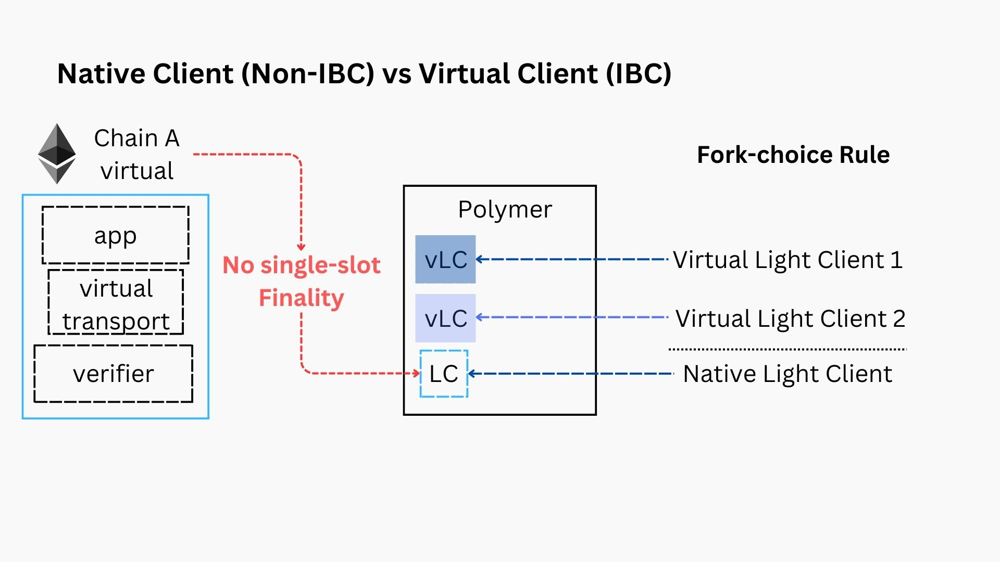

# Virtual IBC unlocks IBC adoption

The design of Polymer started with a few questions. All of them centered around the topic of **accelerating the adoption of the Inter-Blockchain Communication protocol, IBC**.

:::tip Design questions for Polymer

- What does an IBC hub or a chain dedicated to running an IBC workload look like? 
- How can this IBC hub make it easier for chains to integrate IBC while also making IBC as a whole more scalable?
- How do we adapt IBC to modular blockchains and consensus mechanisms that lack single slot finality? 

:::

The architecture of Polymer is an answer to all of these questions. So then, **what's the secret sauce**??

## Making modular interoperability a reality with virtual IBC

As outlined [in the interoperability intro](../background/interop.md), we consider a complete interoperability protocol one that has clear separation between application, transport and state layers. A **modular interop protocol, is one that fully outsources the transport layer** to a dedicated transport hub, like Polymer

:::info Modular interoperability

The application and transport layer separation have always been part of the IBC design, ever since its conception. This has the benefits of separating the concerns of application and core developers respectively.

Polymer takes this modularity a step further though. Similar to the ideas of _modular blockchains_ introduced by [Celestia](https://celestia.org/learn/basics-of-modular-blockchains/modular-and-monolithic-blockchains/), Polymer proposes the concept of _modular interoperability_. This means that **all 3 layers of an interoperability protocol (app, transport and state) still form a logical whole, yet they can be decoupled onto different chains.**

:::

Polymer’s modular implementation of IBC that separates transport and state layer execution from the application layer is called _virtual IBC (vIBC)_. vIBC is an instantiation of transport layer separation. The naming convention follows the virtual representation of chains that opt to outsource their IBC workload to Polymer. 

### Virtual IBC : definitions

There are a number of high level component definitions that we’ll describe below:

- **Virtual chain**. A chain connected to Polymer for IBC transport. On-chain, application layer or IBC enabled smart contracts interact with a set of vIBCCore (IBC transport logic) contracts through [ICS-26 callbacks](https://github.com/cosmos/ibc/blob/main/spec/core/ics-026-routing-module/README.md) and [ICS-4](https://github.com/cosmos/ibc/blob/main/spec/core/ics-026-routing-module/README.md) packet lifecycle methods. The chain is considered virtual because the IBC transport logic does not live on-chain. The vIBCCore contracts instead bind asynchronously to the IBC core or transport implementation that lives on Polymer.

- **Virtual root**. A transport commitment root to all of the network data produced by a chain. Network data consists of all IBC connection, channel and packet data. This commitment (refer to [ICS-23](https://github.com/cosmos/ibc/blob/main/spec/core/ics-026-routing-module/README.md)) is **produced by Polymer on behalf of a virtual chain**. The virtual root is a deterministic mapping of state of a blockchain and IBC events to a transport commitment. In the context of IBC, the virtual root also serves as the `ConsensusState` of the virtual chain. 

- **Virtual connection**. A [localhost IBC](https://github.com/cosmos/ibc/blob/main/spec/client/ics-009-loopback-cilent/README.md) connection that represents the IBC connection from Polymer to the virtual chain. A localhost connection is used here because Polymer is running IBC transport logic on behalf of the virtual chain which means that we need to represent an IBC connection from Polymer to itself.

- **vIBC relayer**. A relayer implementation that listens for a standard set of events that bind the vIBCCore contract to the channel and packet lifecycle through ICS-24 callbacks [CITE] and ICS-4 packet methods [CITE].

- **vIBC module**. IBC entrypoint for virtual chains. Main differentiation point from the canonical IBC module is that the vIBC module handles the same things asynchronously and also for more diverse client types. It supports remote registration of ports for IBC enabled contracts, asynchronous acknowledgements and management of clients without single slot finality and more. It’s also responsible for producing virtual roots from the consensus states of a native light client.

- **Loopback light client**. A [light client](https://github.com/cosmos/ibc/blob/main/spec/client/ics-009-loopback-cilent/README.md) that is used for a localhost IBC connection which represents an IBC connection from a chain to itself. This client has **read-only access to the local state store**. Used in vIBC to establish a virtual connection between Polymer and a virtual chain. (Not technically a vIBC specific concept but is documented here since it is heavily used within vIBC).

- **Native light clients**. A client that represents the consensus or execution of the virtual chain. While traditional IBC clients are defined in the language of the IBC implementation, native light clients can be defined in any language or runtime. Native light clients leverage a plugin architecture to talk to the vIBC module. They also have looser restrictions around properties like having multiple consensus states at the same height which can make them IBC incompatible.

- **Virtual light clients**. A client that represents **an IBC compatible read-only view into the state of a native light client**. The read only view maps to a virtual root generated by the vIBC module. Intuitively, the virtual light client implements a fork choice rule over the view of the native light client. A single native light client may have multiple virtual light clients. Virtual light clients may express configurations such as security parameters on construction.

We'll explore these concepts in more depth in the following sections.

## Virtual transport with vIBC

At a high level, a virtual chain is outsourcing its interoperability workload to Polymer. Polymer establishes a virtual IBC connection to virtual chains and a concrete IBC connection to IBC native chains. 

:::note

Note that chains are not required to connect virtually to Polymer. Chains can establish non-virtual IBC connections with Polymer as well.

:::

In the following diagram, the connection between a virtual chain to an IBC chain is visualized. The virtual chain relies on Polymer for IBC transport while the IBC chain has a native IBC integration. 

How can we reason about the implications of outsourcing the transport layer to Polymer, or modularizing IBC?

Let's consider this diagram for native  IBC chains.

IBC applications interact with the core IBC implementation that implements the client, connection and channel abstractions through the IBC handler and router submodules. In native IBC, these are all part of the same chain environment.

Consider now the following diagram where vIBC is introduced to enable IBC on a virtual chain, through outsourcing its interopeability workload onto Polymer.

- **IBC applications**: IBC application modules can be developed on the virtual chain as if it were a native IBC chain.

- **vIBC core smart contracts**: These contracts, deployed on the virtual chain, facilitate the IBC apps on the virtual chain to communicate with the transport layer on the remote Polymer hub by binding to it asynchronously.

- **vIBC relayer**: A relayer that listens to events related to the IBC lifecycle, emitted by vIBC core smart contracts, it then relays these events to the vIBC module on Polymer.

- **vIBC module**: Essentially a module that manages the translation of the virtual IBC world to the regular IBC world (provided by Polymer's native IBC module) and vice versa.

:::tip How to reason about vIBC?

From the diagrams above, it should become clear that vIBC is essentially the answer to the question how to adapt IBC when it is modular, i.e. the transport layer lives on another chain than the applications using it.

Another way look at it, is to consider it an extension of the IBC handler/router submodules to facilitate IBC communication asynchronously across chains.

:::

We look at the implications for clients and the computation of the virtual root or trasport commitment in more detail next.

## Native vs virtual clients

The native light client processes all headers produced by the virtual chain. Single slot finality is not a requirement. All valid headers are accepted by the client. This allows the native light client to have a broad network view of all of the active forks of a virtual chain. IBC events emitted on the virtual chain are verified against valid consensus states persisted by the native light client. 

A virtual light client may define a security parameter over its view into the native light client that can be used in constructing virtual connections with different latencies. For example, a virtual light client could be constructed that waits for finalized headers with higher latency while another could be constructed that waits a few blocks with lower latency. The higher latency connection is far more secure and can be used for high value transactions while the lower latency connection can be used for low value transactions. There is a tradeoff here between security and user experience.

Since the IBC transport layer does not expect any forks, the virtual light client essentially implements a fork choice rule over the forks in the native light client. A fork choice rule may specify a weighting algorithm which would be consistent with the consensus of the virtual chain to determine which fork to follow. It may also specify an aggregation rule which merges the views of a number of forks into one. The latter is useful in the case where it’s difficult to determine the canonical fork in the short term. Fork handling is explored in detail in section 4.2f.  

From the virtual light client onwards, the rest of the architecture is consistent with general IBC architecture. As visualized above, normal IBC operations happen on the right side of the diagram where we have a standard IBC relayer establishing an IBC channel over two IBC connections using multi-hop IBC. Multi-hop IBC is explored [here](./ibc/multi-hop.md).

### Client creation

Client creation involves creating both a native and a virtual light client. When the chain has single slot finality, both the native and the virtual light clients are one and the same. However, when the chain does not have single slot finality, a native light client is created that captures all of the active forks of the chain. Multiple virtual light clients are allowed to be created as each implements a fork choice rule on top of the native light client’s view.

A virtual IBC connection is created between the virtual chain’s ConsensusState or virtual root and Polymer. The virtual IBC connection is a local IBC connection on Polymer and is done over a loopback IBC client. Virtual IBC connections allow connected chains to be aware of the state of the virtual chain separately from the state of Polymer. With multi-hop IBC, the virtual root serves as the channel end that chains can connect to.

<!-- See what to keep -->

## Accounting for forks

Another issue of Ethereum with regards to IBC compatibility, is that it does not have single-slot (fast) finality. Finality is a requirement for native IBC integration. So how do we go about solving that?

The IBC specification did already foresee a solution for this, which the Polymer protocol drew inspiration from. From [the spec](https://github.com/cosmos/ibc/blob/5394ad096835f536a34678acaffd014c14c7d3b3/spec/core/ics-002-client-semantics/README.md#motivation):

> Quote: The IBC protocol can be used to interact with probabilistic-finality consensus algorithms. In such cases, different validity predicates may be required by different applications. For probabilistic-finality consensus, a validity predicate is defined by a finality threshold (e.g., the threshold defines how many block needs to be on top of a block in order to consider it finalized). **As a result, clients could act as thresholding views of other clients**: One write-only client could be used to store state updates (without the ability to verify them), while many read-only clients with different finality thresholds (confirmation depths after which state updates are considered final) are used to verify state updates.

### Native light client

This would be the _write-only_ client mentioned in the IBC spec, to which we supply the headers from the virtual chain.

This client, in virtual IBC lingo we call it a native light client, is **not IBC compatible**.

:::info Altair light client

For Ethereum, we run a light client based on the Altair light client spec. A more elaborate discussion of the light client and sync committees is out of scope of this article, but you can watch [this podcast segment](https://youtu.be/1skznXEWeJM?t=1090) to find out more.

:::

### Virtual light client

Virtual IBC defines virtual light clients that could implement different security parameters for its view into the native light client.

This would be the _read-only_ clients with different finality thresholds, as mentioned in the IBC spec.

Many virtual clients thus can be associated with a single native light client.

:::info

For example, a virtual light client could wait for finalized headers while another virtual light client could only wait a few blocks, establishing a trade-off between security and latency (and thus, UX).

:::

Essentially, the virtual light client establishes a fork-choice-rule over the forks in the native light client. A **virtual light client fulfils the requirements as an IBC client** and can be used to build (virtual) connections on top.

