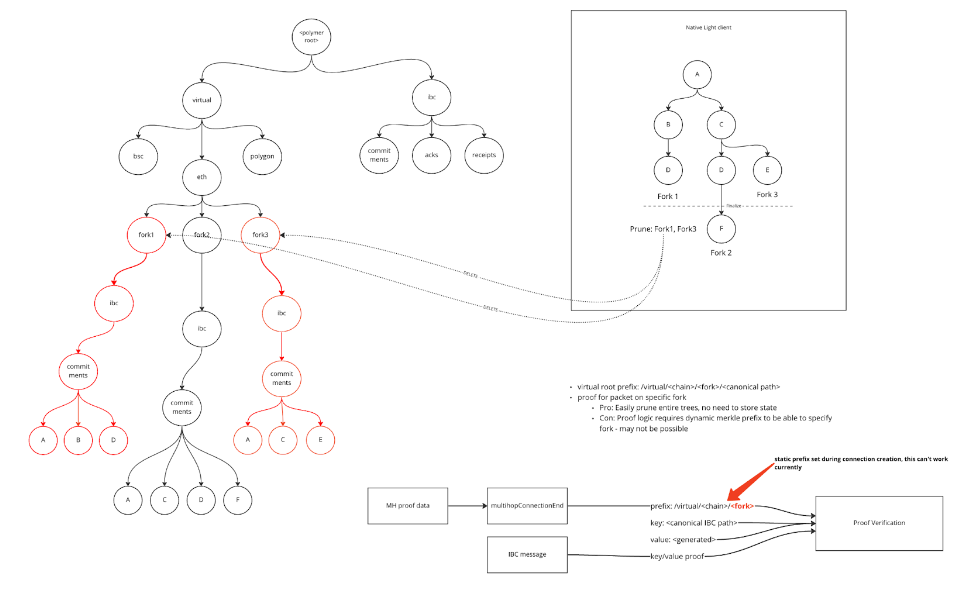

# Native vs Virtual clients

As discussed in the previous sections, one of the functions of the vIBC module is to allow for extending the IBC network by enbaling a more diverse set of chains to adopt IBC. Managing clients and transport commitments is a big part of this feature.

## Native clients

A native light client is a client that **represents the consensus or execution of the virtual chain**. While traditional IBC clients are defined in the language of the IBC implementation, native light clients can be defined in any language or runtime. Native light clients leverage a plugin architecture to talk to the vIBC module. They also have looser restrictions around properties like having multiple consensus states at the same height which can make them _IBC incompatible_.

The native light client processes all headers produced by the virtual chain. Single slot finality is not a requirement. All valid headers are accepted by the client. This allows the native light client to have a broad network view of all of the active forks of a virtual chain. IBC events emitted on the virtual chain are verified against valid consensus states persisted by the native light client. 

## Virtual light clients

A virtual ligth client is a client that represents an **IBC compatible read-only view into the state of a native light client**. The read only view maps to a virtual root generated by the vIBC module. A single native light client may have multiple virtual light clients. Virtual light clients may express configurations such as security parameters on construction.

1. Since the IBC transport layer does not expect any forks, the virtual light client essentially implements a _fork choice rule_ over the forks in the native light client. A fork choice rule may specify a weighting algorithm which would be consistent with the consensus of the virtual chain to determine which fork to follow. It may also specify an aggregation rule which merges the views of a number of forks into one. The latter is useful in the case where it’s difficult to determine the canonical fork in the short term.

2. Additionally, a virtual light client may define a security parameter over its view into the native light client that can be used in constructing virtual connections with different latencies. For example, a virtual light client could be constructed that waits for finalized headers with higher latency while another could be constructed that waits a few blocks with lower latency. The higher latency connection is far more secure and can be used for high value transactions while the lower latency connection can be used for low value transactions. There is a tradeoff here between security and user experience.

:::info Reference in the IBC specs 

The IBC specification did already foresee a solution for this, which the Polymer protocol drew inspiration from. From [the spec](https://github.com/cosmos/ibc/blob/5394ad096835f536a34678acaffd014c14c7d3b3/spec/core/ics-002-client-semantics/README.md#motivation):

> Quote: The IBC protocol can be used to interact with probabilistic-finality consensus algorithms. In such cases, different validity predicates may be required by different applications. For probabilistic-finality consensus, a validity predicate is defined by a finality threshold (e.g., the threshold defines how many block needs to be on top of a block in order to consider it finalized). **As a result, clients could act as thresholding views of other clients**: One write-only client could be used to store state updates (without the ability to verify them), while many read-only clients with different finality thresholds (confirmation depths after which state updates are considered final) are used to verify state updates.

:::

## Fork handling and virtual roots

Each fork in the native light client is mapped to a virtual root within the vIBC module. The vIBC module is responsible for following each active fork and incrementally computing the virtual root based on IBC events emitted in the fork. The fork choice rule of the virtual light client determines how a virtual root is computed and also which virtual root is presented as the consensus state of the virtual client.

:::note Example: Ethereum fork choice rule

In the case where Ethereum is the virtual chain, the fork choice rule before finalization is an aggregate rule where the entire network state of Ethereum across all forks is consumed to produce an aggregate virtual root. An aggregate rule is chosen here because it is difficult to determine the canonical fork or chain before finalization. Upon finalization, all stale forks are dropped and the virtual root is trimmed to only contain commitments to IBC events produced in the canonical or finalized fork. This means that the virtual light client view of the virtual chain is eventually consistent for chains without single slot finality.

:::

The _virtual root_ or _transport commitment_  is purely a function of the state of the virtual chain and consists of all IBC connection, channel and packet data. This commitment (refer to [ICS-23](https://github.com/cosmos/ibc/tree/main/spec/core/ics-023-vector-commitments)) is **produced by Polymer on behalf of a virtual chain**. The virtual root is a deterministic and provable mapping of state of a blockchain and IBC events to a transport commitment. In the context of IBC, the virtual root also serves as the `ConsensusState` of the virtual chain.

:::info Comparison with other interoperability protocols?

In many interoperability protocols, the transport commitment is computed on-chain in a merkle tree implemented within a smart contract. Polymer just moves the computation of this transport commitment off-chain and follows the IBC transport specifications.

:::

### Implementation on Polymer

A number of virtual root commitment strategies were considered. Key value data for IBC related commitments could be written:

- ❌ directly to Polymer’s state tree without namespacing
- ❌ a shared namespace for different forks could be used for per single virtual client: `../virtual/<chain>/clientId` 
- ✅ a more granular approach using a namespace per fork: `../virtual/<chain>/<fork>/`

The main challenge when deciding if and how to namespace were around issues such as **pruning complexity**. Reference counting the  number of times a commitment appears in active forks would be required to inform a pruning mechanism.

Incrementally committing to a virtual root for each fork makes pruning much simpler. 

:::tip Thinking ahead towards a fully zk-IBC implementation

Other advantages include making it easier to validate the virtual root commitment in a zkSNARK circuit. Having other key value data mixed in with IBC key value data increases the work a prover must do and the complexity of the IBC transport circuit. The IBC transport circuit should be limited to only mapping the IBC events generated within a fork to a virtual root commitment.

:::

