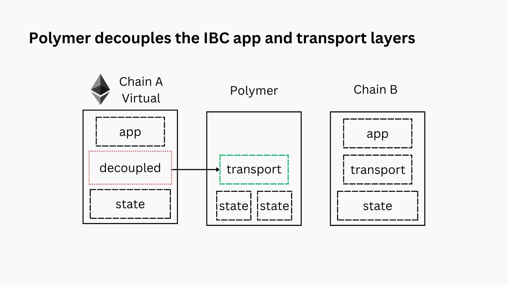

# Virtual IBC unlocks IBC adoption

The design of Polymer started with a few questions. All of them centered around the topic of **accelerating the adoption of the Inter-Blockchain Communication protocol, IBC**.

:::tip Design questions for Polymer

- What does an IBC hub or a chain dedicated to running an IBC workload look like? 
- How can this IBC hub make it easier for chains to integrate IBC while also making IBC as a whole more scalable?
- How do we adapt IBC to modular blockchains and consensus mechanisms that lack single slot finality? 

:::

The architecture of Polymer is an answer to all of these questions. So then, **what's the secret sauce**??

## Making modular interoperability a reality with virtual IBC

As outlined [in the interoperability intro](../../background/interop.md), we consider a complete interoperability protocol one that has clear separation between application, transport and state layers. A **modular interop protocol, is one that fully outsources the transport layer** to a dedicated transport hub, like Polymer.

:::info Modular interoperability

The application and transport layer separation have always been part of the IBC design, ever since its conception. This has the benefits of separating the concerns of application and core developers respectively.

Polymer takes this modularity a step further though. Similar to the ideas of _modular blockchains_ introduced by [Celestia](https://celestia.org/learn/basics-of-modular-blockchains/modular-and-monolithic-blockchains/), Polymer proposes the concept of _modular interoperability_. This means that **all 3 layers of an interoperability protocol (app, transport and state) still form a logical whole, yet they can be decoupled onto different chains.**

:::

Polymer’s modular implementation of IBC that separates transport and state layer execution from the application layer is called _virtual IBC (vIBC)_. vIBC is an instantiation of transport layer separation. The naming convention follows the virtual representation of chains that opt to outsource their IBC workload to Polymer. 

### Design requirements

When designing _virtual IBC_ as the solution to enable modular interoperability, we had the following design principles (requirements) in mind:

- Ensure **compliance with the IBC** specification: don't introduce extra fragmentation and incompatible transport layers.

- Ensure there's a **formal specification for vIBC** so that other implementations of it can be developed (e.g. in Rust to complement ibc-rs).

- Ensure there's a **transparent upgrade path** to native IBC integration: application nor assets are locked into Polymer and can upgrade to native IBC should it become available.

- Connected chains may seamlessly **switch between native and virtual IBC** on a _per connection basis_.

- Standardize IBC transport commitment format to make it possible to **upgrade multi-hop channels** to switch the underlying connections without interruption of connectivity or application migration.

## Virtual IBC : definitions
:::note Quick semantic overview
The upcoming sections will elaborate on these, but below is an overview of high level component definitions in virtual IBC:
:::

- **Virtual chain**. A chain connected to Polymer for IBC transport. On-chain, application layer or IBC enabled smart contracts interact with a set of vIBCCore (IBC transport logic) contracts through [ICS-26 callbacks](https://github.com/cosmos/ibc/blob/main/spec/core/ics-026-routing-module/README.md) and [ICS-4](https://github.com/cosmos/ibc/blob/main/spec/core/ics-026-routing-module/README.md) packet lifecycle methods. The chain is considered virtual because the IBC transport logic does not live on-chain. The vIBCCore contracts instead bind asynchronously to the IBC core or transport implementation that lives on Polymer.

- **Virtual root**. A transport commitment root to all of the network data produced by a chain. Network data consists of all IBC connection, channel and packet data. This commitment (refer to [ICS-23](https://github.com/cosmos/ibc/blob/main/spec/core/ics-026-routing-module/README.md)) is **produced by Polymer on behalf of a virtual chain**. The virtual root is a deterministic mapping of state of a blockchain and IBC events to a transport commitment. In the context of IBC, the virtual root also serves as the `ConsensusState` of the virtual chain. 

- **Virtual connection**. A [localhost IBC](https://github.com/cosmos/ibc/blob/main/spec/client/ics-009-loopback-cilent/README.md) connection that represents the IBC connection from Polymer to the virtual chain. A localhost connection is used here because Polymer is running IBC transport logic on behalf of the virtual chain which means that we need to represent an IBC connection from Polymer to itself.

- **vIBC relayer**. A relayer implementation that listens for a standard set of events that bind the vIBCCore contract to the channel and packet lifecycle through [ICS-26 callbacks](https://github.com/cosmos/ibc/blob/main/spec/core/ics-026-routing-module/README.md) and I[ICS-4](https://github.com/cosmos/ibc/blob/main/spec/core/ics-026-routing-module/README.md) packet lifecycle methods.

- **vIBC module**. IBC entrypoint for virtual chains. Main differentiation point from the canonical IBC module is that the vIBC module handles the same things asynchronously and also for more diverse client types. It supports remote registration of ports for IBC enabled contracts, asynchronous acknowledgements and management of clients without single slot finality and more. It’s also responsible for producing virtual roots from the consensus states of a native light client.

- **Loopback light client**. A [light client](https://github.com/cosmos/ibc/blob/main/spec/client/ics-009-loopback-cilent/README.md) that is used for a localhost IBC connection which represents an IBC connection from a chain to itself. This client has **read-only access to the local state store**. Used in vIBC to establish a virtual connection between Polymer and a virtual chain. (Not technically a vIBC specific concept but is documented here since it is heavily used within vIBC).

- **Native light clients**. A client that represents the consensus or execution of the virtual chain. While traditional IBC clients are defined in the language of the IBC implementation, native light clients can be defined in any language or runtime. Native light clients leverage a plugin architecture to talk to the vIBC module. They also have looser restrictions around properties like having multiple consensus states at the same height which can make them IBC incompatible.

- **Virtual light clients**. A client that represents **an IBC compatible read-only view into the state of a native light client**. The read only view maps to a virtual root generated by the vIBC module. Intuitively, the virtual light client implements a fork choice rule over the view of the native light client. A single native light client may have multiple virtual light clients. Virtual light clients may express configurations such as security parameters on construction.

We'll explore these concepts in more depth in the following sections.

