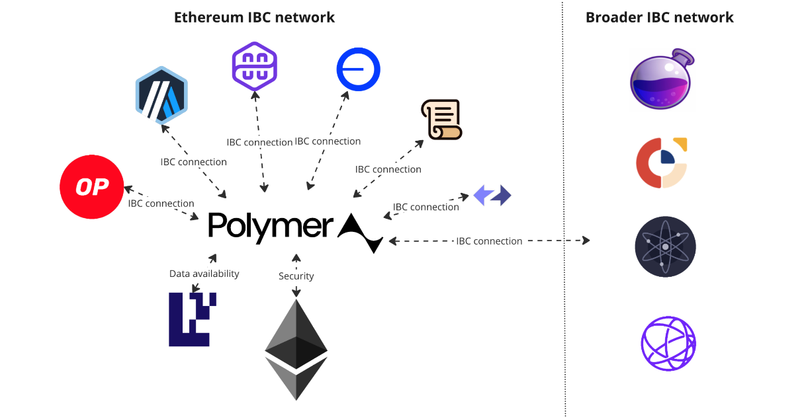

# Introducing Polymer

Interoperability for rollups on Ethereum today is both highly [fragmented](interop.md) and insecure. Polymer solves this by bringing the strong interoperability foundation set by [IBC](../learn/ibc/ibc.md) to Ethereum and its ecosystem of rollups. Our [approach](../learn/polymer/polymer-stack.md) to doing so is to put the Cosmos SDK on top of the OP stack and build **Ethereum’s first interoperability hub**. 

Polymer is built around these three technical pillars:

:::info Polymer's 3 technical pillars

1. **Ethereum Security**: an Ethereum rollup itself, Polymer shares security with the rollups it provides interoperability.

2. **Native IBC interoperability**: having no _enshrined in-protocol_ interoperability standards, Polymer ports the IBC standard into the Ethereum ecosystem.

3. **Scalable connectivity**: as an _app rollup_ Polymer specializes to provide interoperability service to all Ethereum rollups featuring low cost of connectivity and high scalability.

:::

Let's investigate these in more detail.

## 1. Ethereum security

The rollup-centric roadmap has surfaced as the way forward for the Ethereum ecosystem to tackle its scalability challenges. However, this approach hasn’t been without tradeoffs. Sharding execution across rollups, while enabling scalability, has come at the expense of creating relatively siloed execution environments that fragment liquidity, confuse end users, and complicate the developer journey. Secure composability across Layer 2s has emerged as one of the most significant issues plaguing Ethereum.

There is currently no _enshrined_ interoperability protocol in the Ethereum ecosystem creating a lack of standardization. All of the existing arbitrary messaging bridges (AMBs) are implemented as smart contracts with diverging implementations causing [fragmented composability](interop.md). These problems are expected to get worse as we enter a period of exponential growth of L2 launches.

Realizing the potential of introducing an interoperability standard to provide rollup-to-rollup communication (arbitrary message passing) for the Ethereum rollups, Polymer has decided to build as a rollup settling on Ethereum. We examine the major benefit below.

### Trust-minimisation by sharing security

Settling on Ethereum means benefitting from its high security. That's not all though. Additionally, there's an important benefit gained with regards to security _when an interoperability hub shares a settlement layer with the chains it's providing connectivity for_. 

Consider competing interoperability providers that have an intermediate validator set, guardian set or oracles in between the source and destination chains. This introduces additional security assumptions that introduce an attack vector associated with potentially much less economic stake.

Polymer's design as an Ethereum L2 providing connectivity to other Ethereum secured L2s, [eliminates this additional trust assumption](../learn/polymer/security-latency.md/#security).

## 2. Native IBC interoperability

IBC is best positioned to become the interoperability standard for Ethereum specifically and the entire web3 industry more broadly. It’s an open and neutral standard with no single entity controlling the direction of the technology. It’s the product of a [collaboration across a number of teams](https://www.ibcprotocol.dev/technical-resource-catalog) and exists as both a [formal specification](https://github.com/cosmos/ibc) and a number of implementations across a growing number of ecosystems.

The ethos of IBC has some interesting benefits for cross-chain builders.

### Zero Value Capture & Open Competition

IBC has no value capture at the protocol level. It also enables open competition in terms of connectivity. An IBC channel (user/developer facing) can be formed over any list of IBC connections (more infra facing). A connection over an IBC hub is **unable to create a vendor lock in** for bridged tokens over the [ICS20 standard](https://tutorials.cosmos.network/academy/3-ibc/7-token-transfer.html). 

_How you ask?_

IBC allows any channel to be updated (via a feature called _channel upgradability_) to use another underlying connection.The protocol allows for either using another middle hop/router or to connect directly with its destination. 

### Transparent Upgrades

Polymer’s architecture allows it to enable IBC on connected chains and make them visible to the IBC network without the chains needing to implement IBC themselves, using a protocol called [_virtual IBC_](../learn/vibc/overview.md). 
However, chains connected via Polymer are **not locked into using Polymer**. If the chain ends up implementing IBC natively, a channel upgrade can be performed to update the underlying list of connections from using Polymer to another hub or direct connection.

### Open Client Marketplace

The [IBC client design is flexible](../learn/ibc/ibc-clients.md) enough to represent arbitrary verification logic. They are not restricted to verifying the consensus of a chain. In fact, **many interoperability protocols today could easily be represented as an [IBC solo machine client](https://medium.com/the-interchain-foundation/ibc-beyond-light-clients-solo-machine-5af93618ef63)** which can support one or more private keys. The IBC network itself is essentially client agnostic and allows client builders to compete with one another for business. 

## 3. Scalable connectivity

Polymer could be described as an _application-specific rollup_ or _app rollup_. This is a concept borrowed from early adopters like the Cosmos or Polkadot ecosystems. It introduces a chain (or rollup) that offers no general-purpose platform for developers to build applications on, but rather a specialized service, thus application specific.

Ethereum itself has opted for protocol minimalism at the L1 level. This is a similar approach to the Cosmos Hub whose major function (this philosophy is called _hub minimalism_) is to provide security, where functionality is implemented by chains that are secured by the L1 (Cosmos Hub) through [interchain security (ICS)](https://interchainsecurity.dev/). For example, Ethereum is leaning on L2s for scalability and sharding whereas the Cosmos Hub is leaning on ICS chains for a smart contract chain ([Neutron](https://neutron.org/)) and liquid staking ([Stride](https://www.stride.zone/)) etc. 

Polymer is being built as an L2 on Ethereum’s dedicated to one application, interoperability. In a sense, Polymer enshrines IBC interoperability into the Ethereum ecosystem. Its design as an application specific hub allows for scalable connectivity. Let's investigate the benefits.

### Evolution of Network Topologies

There are different high level approaches to interoperability when it comes to network topology. Peer-to-peer or _p2p_ approaches were some of the earliest approaches that were explored. P2P connectivity scales poorly with the number of connected chains as you have an N^2 connectivity problem. 

Hub and spoke approaches came next and improve on the scalability at the cost of introducing a middleman between connected chains. An IBC enabled hub like Polymer further improves on scalability by allowing for a _mesh network topology_ where any chain in the IBC network can connect to any other chain no matter how "distant" using [multi-hop routing](../learn/ibc/multi-hop.md). 

### Polymer as a Port City

By combining its native IBC implementation along with sharing Ethereum as settlement layer with the rollups it connects, Polymer is an ideal IBC hub for Ethereum L2s. However, it doesn't stop there... .

Additionally, Polymer acts a port city (reference to similar [Cosmos Hub metaphor](https://blog.cosmos.network/the-cosmos-hub-is-a-port-city-5b7f2d28debf)) connecting rollups on Ethereum with the growing IBC network effectively making the Ethereum ecosystem a part of the interchain (i.e. the network of IBC connected chains).

:::note How does a Cosmos chain connect with Ethereum rollups via Polymer?

To connect with Polymer (and thus the Ethereum L2), a Cosmos chain would have to run an IBC client to track Polymer's consensus. In other words, it needs to run an Ethereum client. This may not be something every chain may want to do, but one could imagine a setup where the Cosmos Hub or Osmosis runs the client. A multi-hop channel could then be created to connect any IBC enabled Cosmos chain to any Ethereum L2 supported by Polymer. Polymer could act as the port city for Ethereum, the Cosmos Hub (or any other candidate) as the port city for Cosmos.

Same goes for other ecosystems as IBC expansion grows.

:::

### Cost of Connectivity

<!-- TODO: Add reference to comparison table when present -->

Polymer's design aims to lower the cost of connectivity as much as possible. The cost of connectivity is the sum of the cost of client updates, packets, infrastructure and security. Existing interoperability hubs are built as sovereign chains or guardian sets. The cost of infrastructure for these protocols scales with the number of connected chains and validators. These protocols also generally utilize the protocol token for security which results in either low security or a high security budget if they decide to utilize security solutions such as ICS or restaking. 

:::tip Minimizing Cost of connectivity
Polymer as an L2 merges infrastructure and security costs into the cost of settlement. This allows Polymer to provide lower cost of connectivity without trading off security.
:::

## Bonus: A Network of Interoperable Rollups

The secondary goal will play a big part in growing the interchain. Putting the Cosmos SDK on top of the OP stack combines best in class developer experience when it comes to building app chains with powerful settlement functionality. The developer experience when it comes to building app rollups with the existing OP stack is still developing. It’s currently quite challenging to add a new execution engine (EE) in addition to making an EE highly customizable for app developers. In contrast, the Cosmos SDK has been an industry leader for years and has solid developer UX.

:::note Monomer SDK

Combining Cosmos SDK and OP stack technologies, Polymer envisions a new framework to build interoperable rollups.

- Cosmos SDK complements currently lacking developer UX problem in OP stack 

- OP stack for settlement increases the distribution problem for Cosmos tech

More information to follow...

:::
